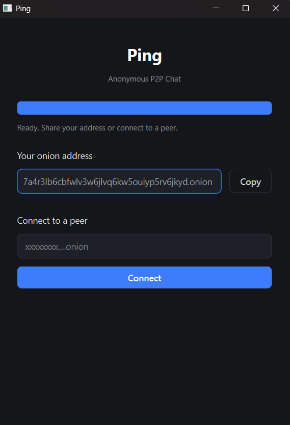
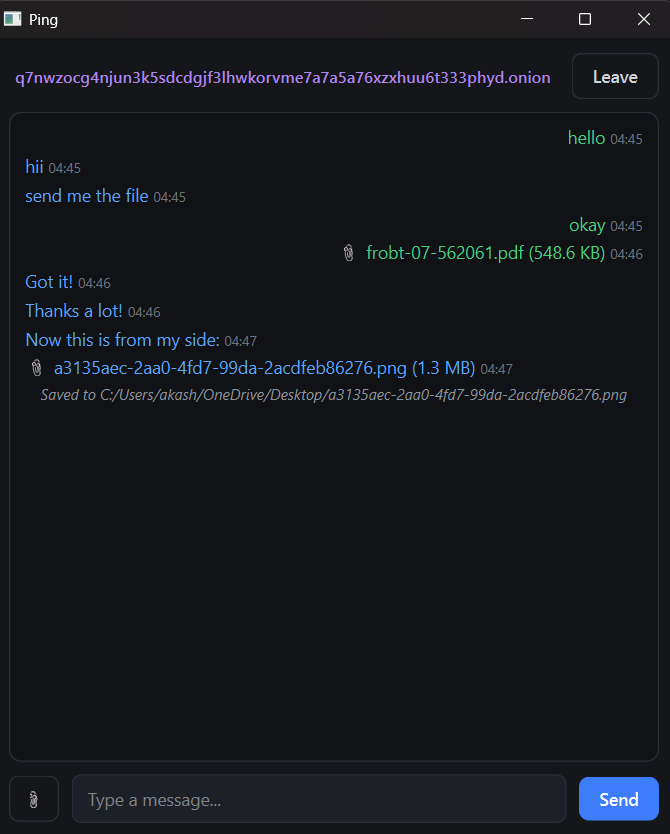

# Ping

**Anonymous, peer-to-peer chat over Tor.** No servers, no accounts. Two people
run Ping, swap `.onion` addresses, and talk directly through Tor — with optional
file transfer. Tor (`tor.exe`) is bundled; nothing to configure.

- 🧅 Onion-routed — no central server, no metadata middleman
- 🔑 Fixed identity derived from a local seed (stable across restarts)
- 💬 Colour-coded chat with timestamps
- 📎 File transfer up to 5 MB

## Screenshots

<p align="center">
  
  &nbsp;&nbsp;
  
</p>

## Requirements

Windows · Python 3.10+ · `PyQt6`, `PySocks`, `stem` (installed below)

## Install & run

```bash
git clone https://github.com/akashbachhar/ping-anonymous-chat.git
cd ping-anonymous-chat
python -m venv .venv
.venv\Scripts\activate
pip install -r requirements.txt
python main.py
```

On first launch Ping generates your onion identity and bootstraps Tor.

## Usage

1. Run `python main.py` on both machines and wait for **"Ready"**.
2. Share your onion address, **or** paste a peer's address and hit **Connect**.
3. Chat. Use **📎** to send a file (max 5 MB); **Leave** ends the chat.

Ping is 1-to-1 — one conversation at a time.

## Project structure

```
main.py            Entry point
pingapp/           App package (protocol, Tor, onion identity, UI)
tor_bin/tor.exe    Bundled Tor executable
tor_data/          Tor runtime data + onion identity (git-ignored)
```

## Security

- `tor_data/onion_seed` **is your identity** — git-ignored; never commit or share it.
- Your onion address is semi-private: anyone with it can reach your chat while
  Ping is running. Delete `onion_seed` to get a new address.
